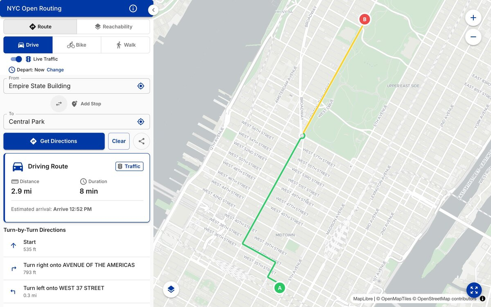
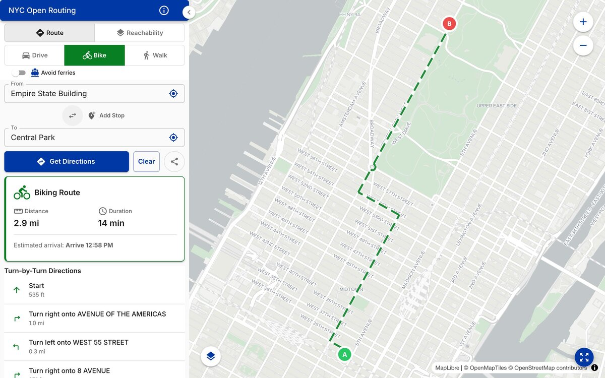
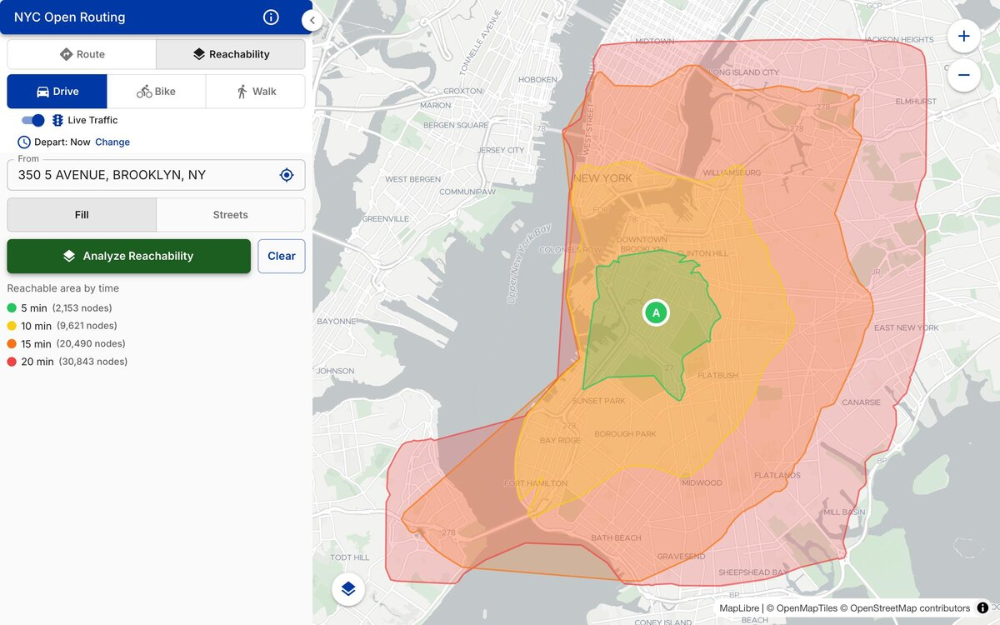
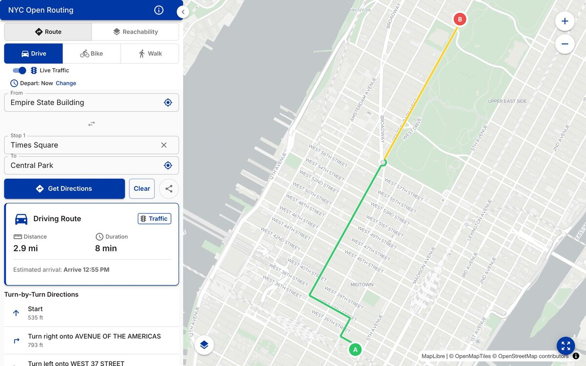
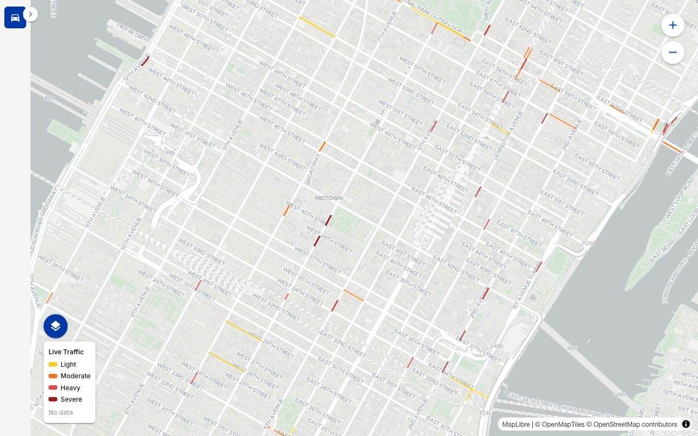
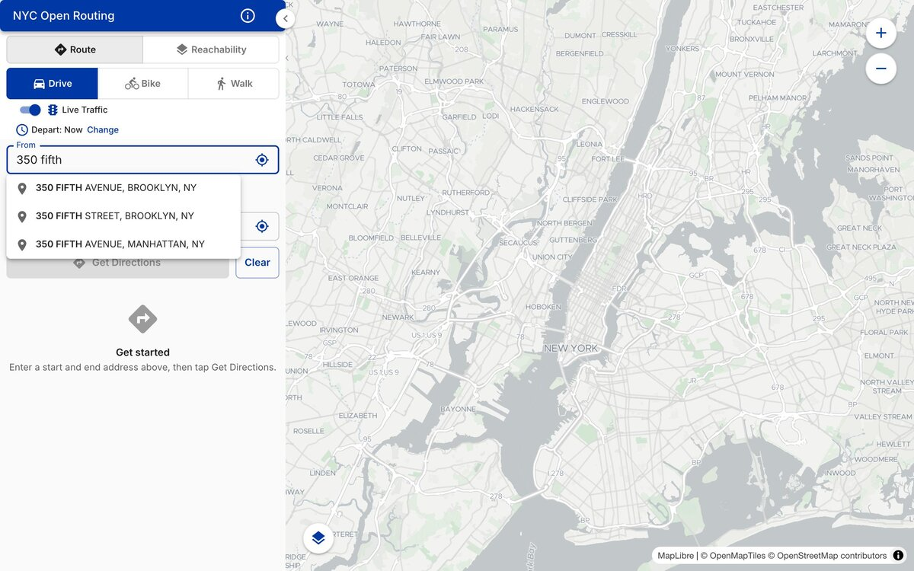
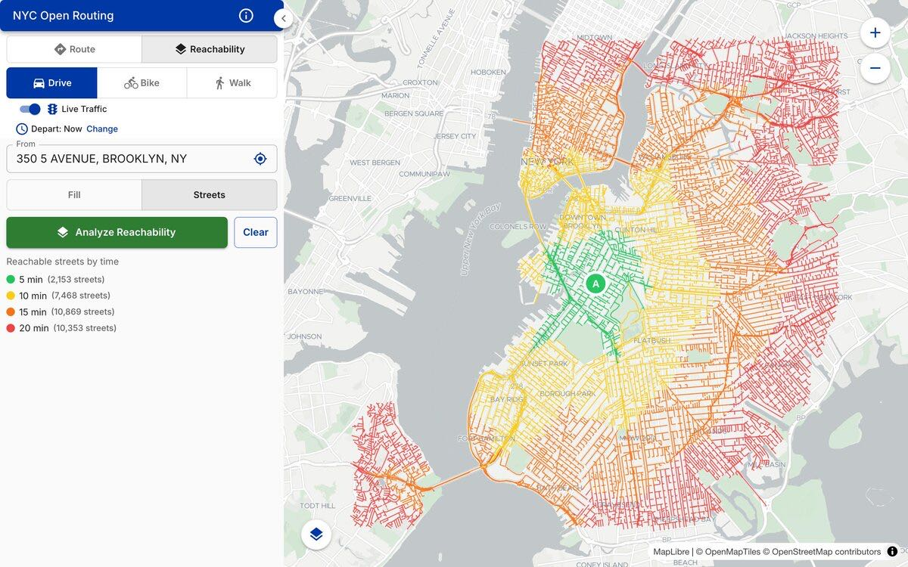
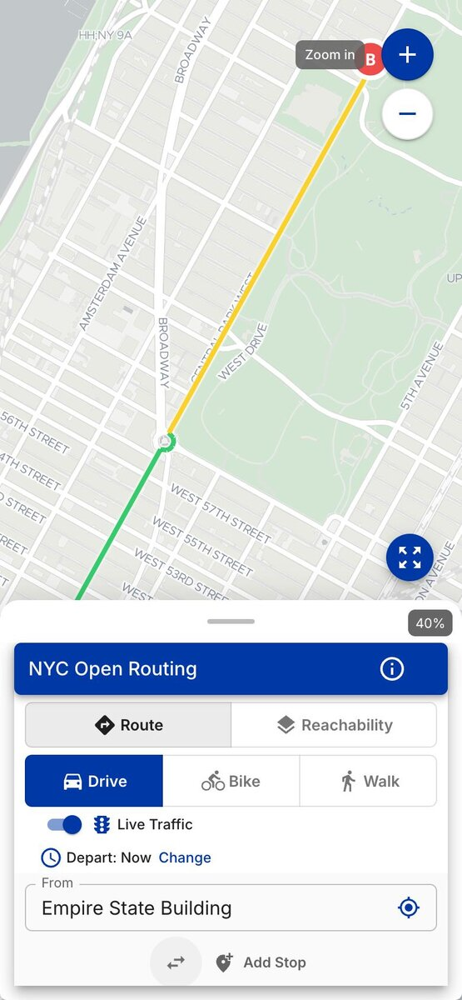

# NYC Open Routing

Multi-modal routing for New York City using pgRouting and NYC's LION street network dataset. Supports driving, walking, and biking routes with turn-by-turn directions, isochrone analysis, and traffic-aware routing.



     

## Features

- **Multi-modal routing** -- Drive, bike, and walk routes with turn-by-turn directions using the Turn-Restricted Shortest Path (pgr_trsp) algorithm
- **Isochrone reachability analysis** -- Visualize how far you can travel in a given time with polygon fill and per-street edge views
- **Multi-stop waypoint routing** -- Plan routes with up to 3 stops, with per-leg summaries and an overall route summary
- **Traffic-aware routing** -- Adjust driving routes using NYC DOT traffic volume data and TRANSCOM real-time speed data
- **NYC address autocomplete** -- Search NYC addresses with type-ahead suggestions powered by Geosupport
- **Departure time selection** -- Choose hour and day of week for time-dependent traffic routing
- **Responsive design** -- Desktop sidebar layout, tablet view, and mobile bottom sheet
- **Shareable routes** -- Deep link URLs encode origin, destination, mode, and waypoints for sharing

<table>
<tr>
<td width="50%">

<p align="center"><strong>Multi-modal routing</strong></p>
</td>
<td width="50%">

<p align="center"><strong>Isochrone reachability</strong></p>
</td>
</tr>
<tr>
<td width="50%">

<p align="center"><strong>Multi-stop waypoints</strong></p>
</td>
<td width="50%">

<p align="center"><strong>Live traffic layer</strong></p>
</td>
</tr>
<tr>
<td width="50%">

<p align="center"><strong>NYC address autocomplete</strong></p>
</td>
<td width="50%">

<p align="center"><strong>Edge-based isochrones</strong></p>
</td>
</tr>
<tr>
<td width="50%">

<p align="center"><strong>Responsive mobile layout</strong></p>
</td>
<td width="50%">
</td>
</tr>
</table>

## Quick Start

```bash
git clone https://github.com/ishiland/nyc-open-routing.git
cd nyc-open-routing
cp .env.example docker/dev/.env
docker compose build
docker compose up -d
```

Import the LION street network (takes 10-30 minutes on first run):

```bash
docker compose exec api sh /data-imports/import-lion.sh 25a
```

Navigate to [http://localhost:3002](http://localhost:3002) when the import completes.

To include traffic volume data for traffic-aware routing, add the `--download-traffic` flag:

```bash
docker compose exec api sh /data-imports/import-lion.sh 25a --download-traffic
```

## Architecture

NYC Open Routing runs three Docker services. The API uses pgRouting's `pgr_trsp` algorithm against a graph built from NYC DCP's LION street network. The graph encodes per-mode edge costs (drive/bike/walk), one-way restrictions, grade-separated intersections (overpasses and underpasses), and optional traffic factors.

| Service | Stack | Ports |
|---------|-------|-------|
| client | React 18 + TypeScript + Vite + MUI + MapLibre GL | 3002 (host) -> 3000 |
| api | Python 3.11 + FastAPI | 5001 (host) -> 5000 |
| db | PostgreSQL 17 + PostGIS + pgRouting | 5433 (host) -> 5432 |

## API

Interactive Swagger docs are available at [http://localhost:5001/api/docs](http://localhost:5001/api/docs) when the API is running.

### GET /api/route

Point-to-point routing between two coordinates.

| Parameter | Type | Required | Description |
|-----------|------|----------|-------------|
| `orig` | string | yes | Origin coordinates (`longitude,latitude`) |
| `dest` | string | yes | Destination coordinates (`longitude,latitude`) |
| `mode` | string | yes | Travel mode: `drive`, `bike`, or `walk` |
| `use_traffic` | bool | no | Traffic-aware routing for drive mode (default: `true`) |
| `avoid_ferries` | bool | no | Avoid ferry crossings for bike/walk (default: `false`) |
| `hour` | int | no | Hour of day for time-specific traffic, 0-23 |
| `day_of_week` | int | no | Day of week for time-specific traffic, 1 (Mon) - 7 (Sun) |

Example request:

```bash
curl "http://localhost:5001/api/route?orig=-74.0117,40.6492&dest=-73.9515,40.7971&mode=drive"
```

Example response:

```json
{
  "features": [
    {
      "type": "Feature",
      "properties": {
        "seq": 1,
        "street": "3 AVENUE",
        "distance": 260.68,
        "travel_time": 0.099,
        "turn_instruction": "Continue on 3 AVENUE",
        "turn_type": "continue",
        "traffic_factor": 1.2
      },
      "geometry": {
        "type": "LineString",
        "coordinates": [
          [-74.01150, 40.65038],
          [-74.01208, 40.64981]
        ]
      }
    }
  ]
}
```

### GET /api/route/waypoints

Multi-stop routing through 2-3 waypoints.

| Parameter | Type | Required | Description |
|-----------|------|----------|-------------|
| `waypoints` | string | yes | Pipe-delimited coordinates (`lon,lat\|lon,lat\|lon,lat`) |
| `mode` | string | yes | Travel mode: `drive`, `bike`, or `walk` |
| `use_traffic` | bool | no | Traffic-aware routing for drive mode (default: `true`) |
| `avoid_ferries` | bool | no | Avoid ferry crossings for bike/walk (default: `false`) |
| `hour` | int | no | Hour of day for time-specific traffic, 0-23 |
| `day_of_week` | int | no | Day of week for time-specific traffic, 1 (Mon) - 7 (Sun) |

```bash
curl "http://localhost:5001/api/route/waypoints?waypoints=-73.98,40.75|-73.99,40.76|-74.00,40.77&mode=drive"
```

### GET /api/isochrone

Reachability analysis from an origin point.

| Parameter | Type | Required | Description |
|-----------|------|----------|-------------|
| `orig` | string | yes | Origin coordinates (`longitude,latitude`) |
| `mode` | string | no | Travel mode: `drive`, `bike`, or `walk` (default: `drive`) |
| `intervals` | string | no | Comma-separated minutes (default: `5,10,15,20`) |
| `view` | string | no | Visualization: `polygon` or `edges` (default: `polygon`) |
| `use_traffic` | bool | no | Traffic-aware costs for drive mode (default: `true`) |
| `hour` | int | no | Hour of day for traffic, 0-23 |
| `day_of_week` | int | no | Day of week for traffic, 1 (Mon) - 7 (Sun) |

```bash
curl "http://localhost:5001/api/isochrone?orig=-73.9857,40.7484&mode=walk&intervals=5,10,15"
```

### GET /api/search

NYC address autocomplete.

| Parameter | Type | Required | Description |
|-----------|------|----------|-------------|
| `address` | string | yes | Partial or full NYC address |

```bash
curl "http://localhost:5001/api/search?address=350%20fifth"
```

## Data Sources

- [LION](https://www.nyc.gov/site/planning/data-maps/open-data/dwn-lion.page) -- NYC Department of City Planning street network dataset
- [Geosupport](https://www.nyc.gov/site/planning/data-maps/open-data/dwn-gde-home.page) -- NYC geocoding system, via [python-geosupport](https://github.com/ishiland/python-geosupport) and [geosupport-suggest](https://github.com/ishiland/geosupport-suggest)
- [NYC DOT Traffic Volumes](https://data.cityofnewyork.us/Transportation/Automated-Traffic-Volume-Counts/7ym2-wayt) -- Static traffic volume data (optional, via `--download-traffic`)
- [TRANSCOM Speed Data](https://data.cityofnewyork.us/Transportation/Real-Time-Traffic-Speed-Data/qkm5-nuaq) -- Real-time traffic speed sensors (optional, via `scripts/import_traffic_speeds.py`)

## License

This project is licensed under the MIT License -- see the [LICENSE](LICENSE) file for details.

## Contributing

See [CONTRIBUTING.md](CONTRIBUTING.md) for development setup and guidelines.
