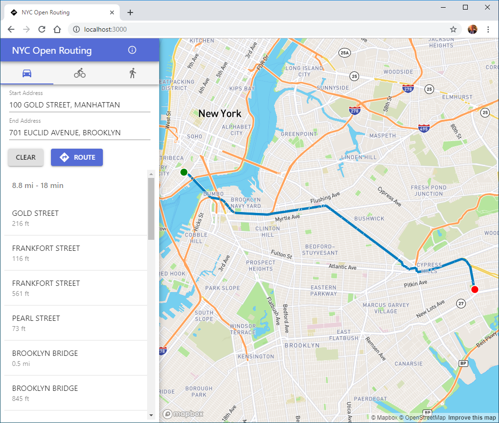

# NYC Open Routing
Routing in NYC with [pgRouting](https://pgrouting.org/) and authoritative NYC data. This project is currently a proof of concept and not intended for real world routing scenarios.



## Features
- Driving, Walking and Biking routes using DCP's [LION](https://www1.nyc.gov/site/planning/data-maps/open-data/dwn-lion.page) data
- Address searching using [Geosupport](https://www1.nyc.gov/site/planning/data-maps/open-data/dwn-gde-home.page) and [geosupport-suggest](https://github.com/ishiland/geosupport-suggest) 
- Routing capabilities using [pgRouting](https://pgrouting.org/)
- Web API using [Flask RESTful](https://flask-restful.readthedocs.io/en/latest/)
- Frontend using [React JS](https://reactjs.org/) and [Mapbox GL JS](https://docs.mapbox.com/mapbox-gl-js/api/)
- Containerized with [Docker](https://docs.docker.com/engine/docker-overview/)

## Getting Started

This projected is orchestrated with docker-compose. 

1. Clone this repo and `cd` into it:

    `git clone https://github.com/ishiland/nyc-open-routing.git`
    
2. Build the project.

     `docker-compose build`
      
3. Start the project.
    
    `docker-compose up -d`
    
    If this is the first time starting, the `api` container will download and install geosupport. You can upgrade geosupport by specifying a different version in the .env file and restarting the service.
    
4. Import the Lion data using the following command:

    `docker-compose exec api sh scripts/import-lion.sh`
    
    You can also specify a version of Lion:
    
    `docker-compose exec api sh /data-imports/scripts/import-lion.sh 23a`
    
5. When its complete navigate to [http://localhost:3001](http://localhost:3001)


## api
Use the flask api to query routes directly. All successful requests return GeoJSON w/MultiLineString geometries. You can comment out the `client` container in the docker-compose.yml if all you require is the api. 

Parameters:

- `orig`: Origin coordinates. Expects a comma separated _lat,long_.
- `dest`: Destination coordinates. Expects a comma separated _lat,long_.
- `mode`: Travel mode. Can be `drive`, `walk` or `bike`

Example request:
http://localhost:5001/api/route?orig=-74.0117,40.649221&dest=-73.951458,40.797061&mode=drive

response:
```js
{
    "features": [
        {
            "properties": {
                "seq": 1,  // sequence of segment in route
                "street": "3 AVENUE",
                "distance": 260.679437746423,  // distance of segment in feet
                "travel_time": 0.0987422112675845,  // travel time of segment in minutes 
            },
            "geometry": {
                "type": "GeometryCollection",
                "geometries": [
                    {
                        "type": "MultiLineString",
                        "coordinates": [
                            [
                                [
                                    -74.01149956053376,
                                    40.65037686591395
                                ],
                                [
                                    -74.01207536260924,
                                    40.649811516367066
                                ]
                            ]
                        ]
                    }
                ]
            }
        },
...
```


### Further Ideas

- Incorporate traffic data to more accurately calculate driving costs. Live or static traffic data would be a significant improvement.
- Add public transit modes using MTA data.
- Ferry schedules for more accurate biking/walking cost.
- Travel time isochrones for selected addresses.
- Line Merge segments where possible to optimize and reduce complexity of graph.
- Optimize functions by adding BBOX parameter. 
- Add turn by turn directions with angle (left, right, sharp right, etc. ) similar to google maps. 
- Send GeoJSON directly from the database using `ST_AsGeoJSON` to remove gdal dependency in `api` container.

### Resources
- https://github.com/mixedbredie/highways-for-pgrouting
- https://docs.pgrouting.org/latest/en/pgRouting-concepts.html
